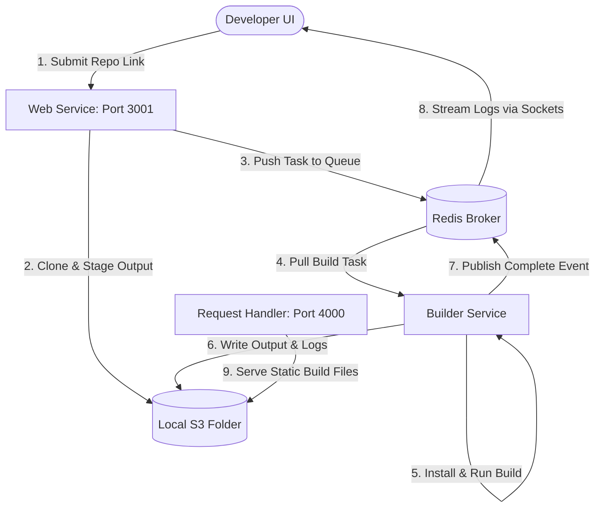
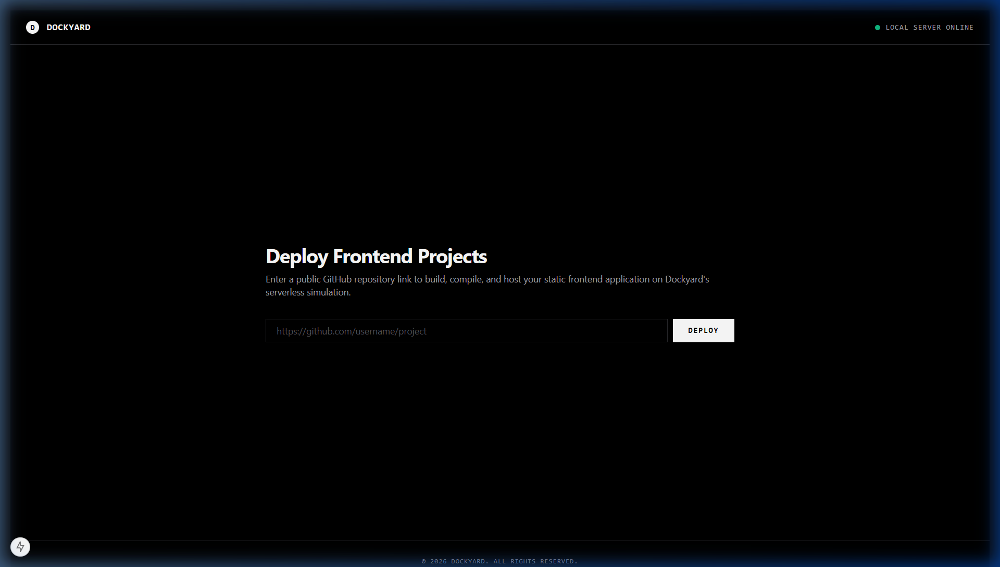
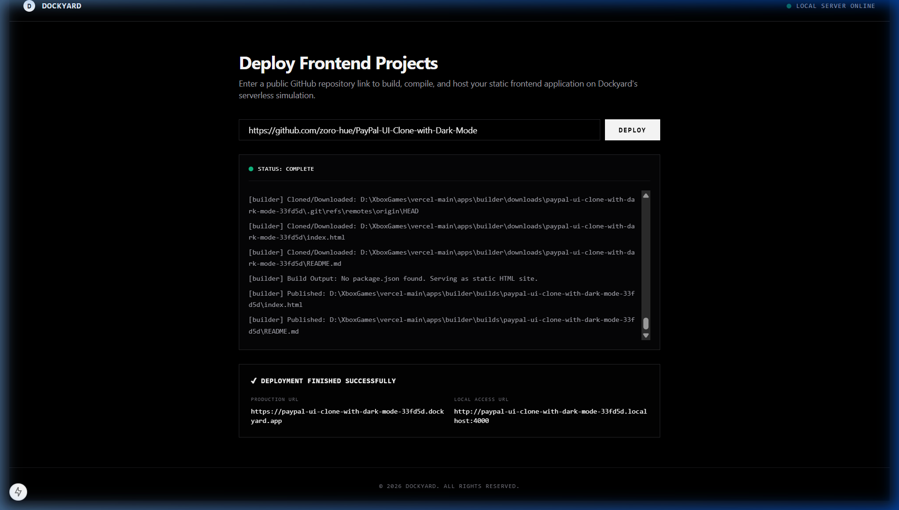
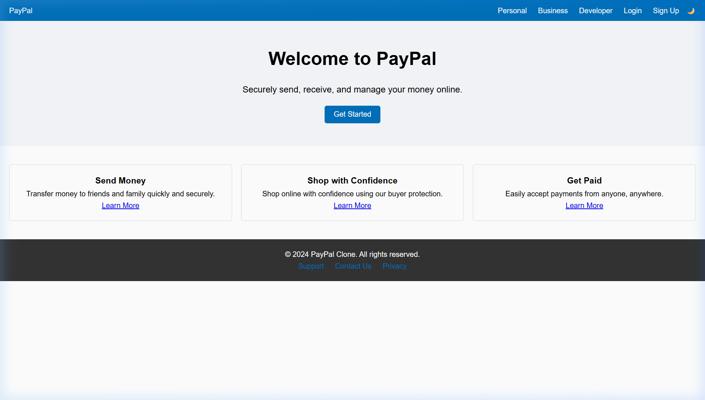
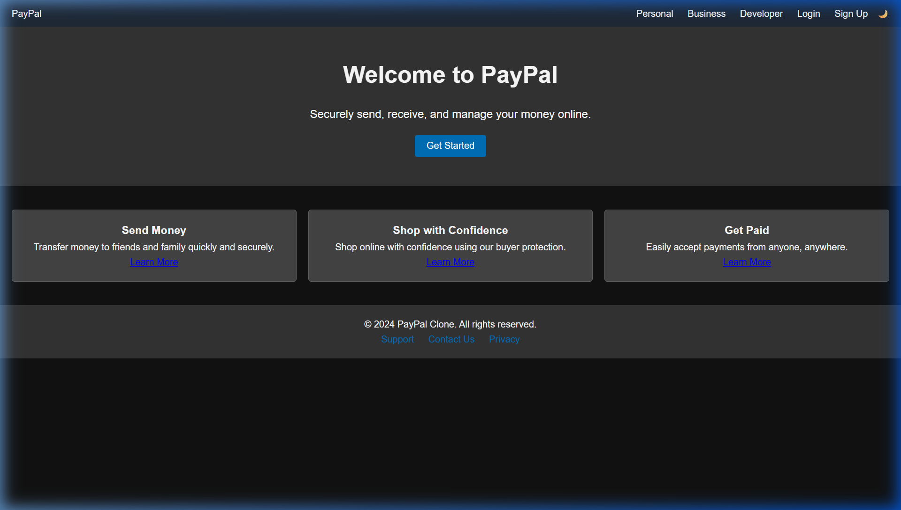

# Dockyard - Frontend Deployment Platform

Dockyard is a modern, frontend deployment platform that **builds, hosts, and streams real-time logs** for web applications. Users can submit a public GitHub repository link; the platform automatically clones the source code, triggers the compilation pipeline, and serves the build outputs via unique local and production-grade URLs.

## Features

- **Instant Deployment**: Submit a repository link to trigger automated build processes.
- **Real-Time Terminal Streaming**: Watch clone, install, compile, and upload stages execute live in a monospace web terminal.
- **Local S3 Simulation**: Zero AWS credential dependencies. Deployments are stored and served from a local mocked filesystem bucket.
- **Flexible Path Routing**: Access deployed websites via custom subdomain routing (`*.localhost:4000`) or clean path-based routing (`localhost:4000/deployments/{id}`).

## Tech Stack

- **Frontend/Backend**: Next.js 15 (React 19)
- **Log Subscriptions**: Redis Pub/Sub, Socket.IO
- **Process Orchestration**: Turborepo Monorepo
- **Storage Layer**: Local simulated S3 directory bucket

---

## System Architecture



---

## Local Setup

1. **Clone the Repository**
2. **Install Workspace Dependencies**
   ```bash
   npm install
   ```
3. **Launch Redis Server**
   Ensure a local Redis instance is running on port `6379`. (If using our portable Redis bin, start it via `redis-bin/redis-server.exe`).
4. **Run Dev Environment**
   ```bash
   npm run dev
   ```
5. **Access the platform**:
   - Dashboard: `http://localhost:3001`
   - Request Handler: `http://localhost:4000`

---

## Project Screenshots

### 1. Dashboard Landing (Empty State)


### 2. Live Build Terminal Logs & Status


### 3. Deployed App (Light Mode Preview)


### 4. Deployed App (Dark Mode Preview)

